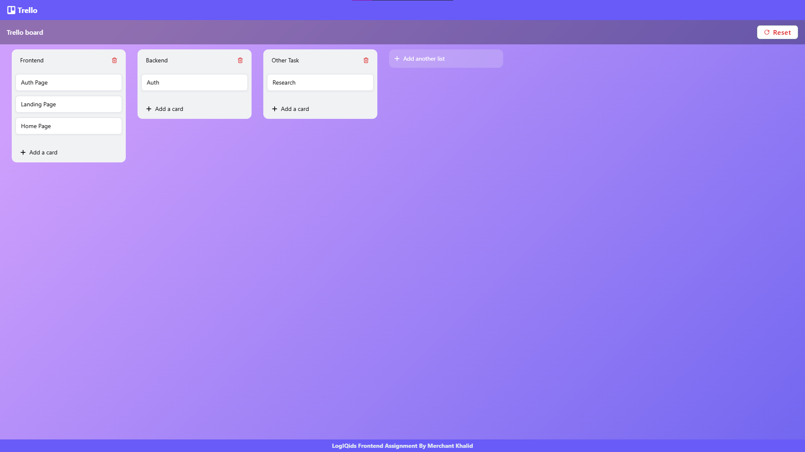

# This Repository Represents Frontend Assignment Given By LogIQids

# About

#### Create a Trello-like board (Trello) that allows users to manage tasks by adding, editing, deleting, and rearranging task cards within multiple lists. This assignment focuses on implementing drag-and-drop functionality, dynamic state updates, and an interactive UI. Use React/Next for this assignment.

# Functionality

- [x] **Add and Manage Lists**: User can add a new list by entering a title, delete a list along with its associated cards, and rename a list title.
- [x] **Add and Manage Cards**: User can add a new card to a specific list by entering a title, Edit the card title, description and due date, and delete a card.
- [x] **Drag-and-Drop**: User can drag and drop cards as well as lists.

# TechStack

### React (Typescript)

### Tailwind CSS

# Screenshot

